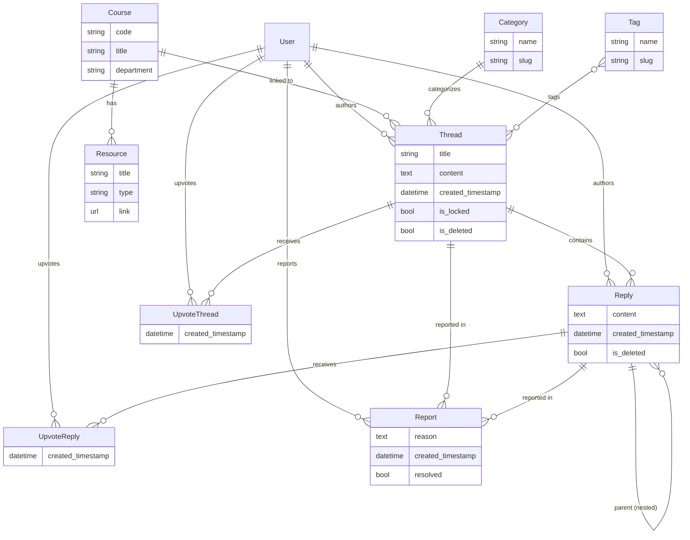

# 📚 StudyDeck Forum

A full-featured discussion forum built for the **StudyDeck** platform, enabling students at **BITS Pilani** to share resources, discuss coursework, and collaborate — all within an authenticated, moderated community.

> Built as a recruitment task for the **Students' Union Technical Team (SUTT)** @ BITS Pilani.

---

## ✨ Features

### 🔐 Authentication & Access Control
- **Google OAuth-only login** via `django-allauth` — no traditional username/password
- Restricted to **BITS Pilani** institutional emails (`@pilani.bits-pilani.ac.in`, `@goa.bits-pilani.ac.in`, `@hyderabad.bits-pilani.ac.in`)
- Custom social account adapter enforces domain validation at login
- Google profile pictures displayed across the UI

### 💬 Discussion Threads
- Create threads associated with a **course**, **resource**, **category**, and **tags**
- **Markdown support** with sanitized rendering (fenced code blocks, tables, images, blockquotes, and more)
- **Syntax-highlighted code blocks** via highlight.js
- **Soft deletion** — threads are marked as deleted rather than permanently removed

### 💬 Replies & Nested Conversations
- Reply directly to threads or **quote/reply to other replies** (nested replies with parent references)
- Pagination-aware links to parent replies across pages
- Markdown content rendering in replies

### 👍 Voting System
- **Upvote/unlike** threads and replies via AJAX (no page reload)
- One upvote per user per item (enforced via database constraints)
- Sort content by popularity (upvote count)

### 🔍 Search
- **Trigram similarity search** on thread titles using PostgreSQL's `pg_trgm` extension
- Fuzzy matching with configurable similarity threshold (> 0.3)

### 🏷️ Organization
- **Categories** — filter threads by category (slug-based routing)
- **Tags** — label threads with multiple tags (ManyToMany)
- **Courses & Resources** — link threads to specific courses and their resources (PDF, Video, Link)
- Dynamic AJAX-powered resource dropdown filtered by selected course

### 🛡️ Moderation Tools
- **Lock/Unlock threads** — prevents new replies on locked threads (permission-gated)
- **Delete any thread/reply** — moderators can remove content from any user
- **Report system** — users can report threads or replies with a reason (one report per user per item)
- **Reports dashboard** — moderators can view all unresolved reports and mark them as resolved

### 📧 Email Notifications
- **Async email notifications** when someone replies to your thread or to your reply
- Console email backend in development; **SMTP (Gmail)** in production
- Notifications sent via background threads to avoid blocking the request

### 📄 Pagination & Sorting
- **10 items per page** for both threads and replies
- Sort by **Latest** or **Popular** (upvote count)
- Order **ascending** or **descending**

---

## 🏗️ Tech Stack

| Layer | Technology |
|-------|-----------|
| **Backend** | Django 6.0 |
| **Database** | PostgreSQL 15 (SQLite3 fallback for local dev) |
| **Authentication** | django-allauth (Google OAuth 2.0) |
| **Markdown** | python-markdown + bleach (sanitization) |
| **Frontend** | Django Templates, Bootstrap 5.3 (dark mode), highlight.js, EasyMDE |
| **WSGI Server** | Gunicorn (production) |
| **Reverse Proxy** | Nginx (production) |
| **Containerization** | Docker & Docker Compose |
| **Package Manager** | uv |
| **Python** | 3.14+ |

---

## 📁 Project Structure

```
studydeck-forum/
├── studydeck/              # Django project configuration
│   ├── settings.py         # Settings (DB, auth, allauth, email, etc.)
│   ├── urls.py             # Root URL routing
│   ├── wsgi.py             # WSGI application
│   └── asgi.py             # ASGI application
│
├── forum/                  # Core forum application
│   ├── models.py           # Course, Resource, Tag, Category, Thread, Reply, Upvotes, Report
│   ├── views.py            # All view logic (CRUD, voting, search, moderation)
│   ├── forms.py            # Thread, Reply, and Report forms
│   ├── urls.py             # Forum URL patterns
│   ├── admin.py            # Admin site registrations
│   ├── templatetags/
│   │   ├── markdown_extras.py   # Markdown → sanitized HTML filter
│   │   └── dict_extras.py       # Dictionary lookup filter
│   ├── templates/forum/
│   │   ├── base.html            # Base layout (navbar, search, user dropdown)
│   │   ├── home.html            # Thread listing with sorting & pagination
│   │   ├── thread_view.html     # Thread detail with replies
│   │   ├── create_thread.html   # Thread creation form
│   │   ├── create_report.html   # Report form
│   │   ├── category_list.html   # Category listing
│   │   └── reports_view.html    # Moderation reports dashboard
│   └── static/forum/
│       ├── css/easyMDEBeautify.css   # EasyMDE editor styling
│       ├── logo.png                   # StudyDeck logo
│       └── default_user.jpg           # Default avatar
│
├── accounts/               # Authentication app
│   ├── adapters.py         # BITS Pilani domain restriction adapter
│   ├── views.py            # Login page view
│   ├── urls.py             # Login URL
│   └── templates/accounts/
│       └── login.html      # Google OAuth login page
│
├── nginx/                  # Nginx reverse proxy (production)
│   ├── Dockerfile
│   └── nginx.conf
│
├── Dockerfile              # Development Docker image
├── Dockerfile.prod         # Production multi-stage Docker image
├── docker-compose.yml      # Development compose (Django + PostgreSQL)
├── docker-compose.prod.yml # Production compose (Gunicorn + PostgreSQL + Nginx)
├── entrypoint.sh           # Dev entrypoint (wait for DB, flush, migrate)
├── entrypoint.prod.sh      # Prod entrypoint (wait for DB, migrate, collectstatic)
├── pyproject.toml          # Python project config & dependencies
├── uv.lock                 # Dependency lock file
└── manage.py               # Django management script
```

---

## 🗄️ Data Models



---

## 🚀 Getting Started

### Prerequisites

- [Docker](https://docs.docker.com/get-docker/) & [Docker Compose](https://docs.docker.com/compose/install/)
- A [Google Cloud Console](https://console.cloud.google.com/) project with OAuth 2.0 credentials

### 1. Clone the repository

```bash
git clone git@github.com:brokenCart/studydeck-forum.git
cd studydeck-forum
```

### 2. Create the `.env` file

Create a `.env` file in the project root with the following variables:

```env
# Django Core Settings
DEBUG=true
SECRET_KEY=django-insecure-development-secret-key-studydeck-1234567890
DJANGO_ALLOWED_HOSTS=localhost 127.0.0.1 [::1] web

# Database Configuration (Docker/PostgreSQL)
DATABASE=postgresql
SQL_ENGINE=django.db.backends.postgresql
SQL_DATABASE=studydeck_db
SQL_USER=studydeck_user
SQL_PASSWORD=securepassword123
SQL_HOST=db
SQL_PORT=5432

# Social Authentication (Google OAuth)
GOOGLE_CLIENT_ID=your-google-client-id
GOOGLE_SECRET=your-google-client-secret

# Email / SMTP Settings (Used when DEBUG is set to false)
EMAIL_HOST_USER=your-email@gmail.com
EMAIL_HOST_PASSWORD=your-email-password
DEFAULT_FROM_EMAIL=your-email@gmail.com
```

> **Note:** Replace `your-google-client-id` and `your-google-client-secret` with your actual Google OAuth credentials. Make sure to add `http://localhost:8000/accounts/google/login/callback/` as an authorized redirect URI in your Google Cloud Console.

### 3. Start the application

```bash
docker compose up --build
```

The application will be available at **http://localhost:8000**.

### 4. Create a superuser (optional)

```bash
docker exec -it studydeck-forum-web-1 python manage.py createsuperuser
```

Access the admin panel at **http://localhost:8000/admin/** to manage courses, categories, tags, resources, and user permissions.

---

## 🏭 Production Deployment

For production, the project uses a multi-stage Docker build with **Gunicorn** as the WSGI server and **Nginx** as a reverse proxy.

### 1. Create production environment files

Create `.env.prod` and `.env.prod.db` with your production credentials.

### 2. Deploy

```bash
docker compose -f docker-compose.prod.yml up --build -d
```

The application will be served at **port 1337** through Nginx.

### Production Architecture

```
Client → Nginx (:80) → Gunicorn (:8000) → Django
                 ↓
         Static Files (/static/)
                 ↓
         PostgreSQL 15
```

---

## 🔑 Permissions & Moderation

The forum uses Django's built-in permissions system for moderation. Assign these permissions via the admin panel:

| Permission | Description |
|-----------|-------------|
| `forum.lock_thread` | Can lock/unlock threads |
| `forum.delete_any_thread` | Can delete any user's thread |
| `forum.delete_any_reply` | Can delete any user's reply |
| `forum.view_report_page` | Can access the reports dashboard and resolve reports |

---

## 🛣️ URL Routes

| URL Pattern | Description |
|------------|-------------|
| `/` | Home — thread listing with search, sort, and filter |
| `/categories/` | Browse all categories |
| `/categories/<slug>/` | Filter threads by category |
| `/create_thread/` | Create a new thread |
| `/thread/<category>/<id>/` | View thread with replies |
| `/thread/<category>/<id>/reply/` | Reply to a thread |
| `/thread/<category>/<id>/reply/<parent_id>/` | Reply to a reply (nested) |
| `/thread/<id>/like/` | Toggle upvote on a thread (AJAX) |
| `/reply/<id>/like/` | Toggle upvote on a reply (AJAX) |
| `/thread/<id>/toggle-lock/` | Lock/unlock a thread (moderator) |
| `/report/thread/<id>/` | Report a thread |
| `/report/reply/<id>/` | Report a reply |
| `/reports/` | View unresolved reports (moderator) |
| `/reports/<id>/resolve/` | Resolve a report (moderator) |
| `/delete/thread/<id>/` | Soft-delete a thread |
| `/delete/reply/<id>/` | Soft-delete a reply |
| `/login/` | Google OAuth login page |
| `/admin/` | Django admin panel |

---

## 🧰 Development

### Code Quality Tools

```bash
# Lint with ruff
uv run ruff check .

# Format with ruff
uv run ruff format .

# Sort imports
uv run isort .

# Lint Django templates
uv run djlint --lint .
```

### Local Development (without Docker)

```bash
# Install dependencies
uv sync

# Run with SQLite (no PostgreSQL needed)
# Remove DATABASE, SQL_* vars from .env or don't create .env
uv run python manage.py migrate
uv run python manage.py runserver
```

> **Note:** Trigram search requires PostgreSQL. When using SQLite, the search feature will not work.

---

## 📝 License

This project was developed as part of the **SUTT recruitment** process at BITS Pilani.
